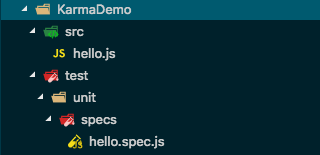
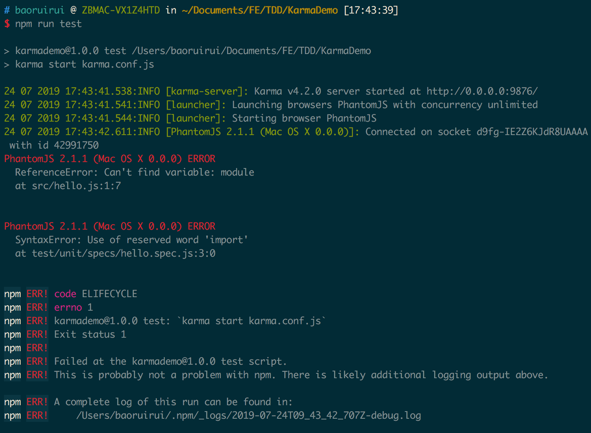
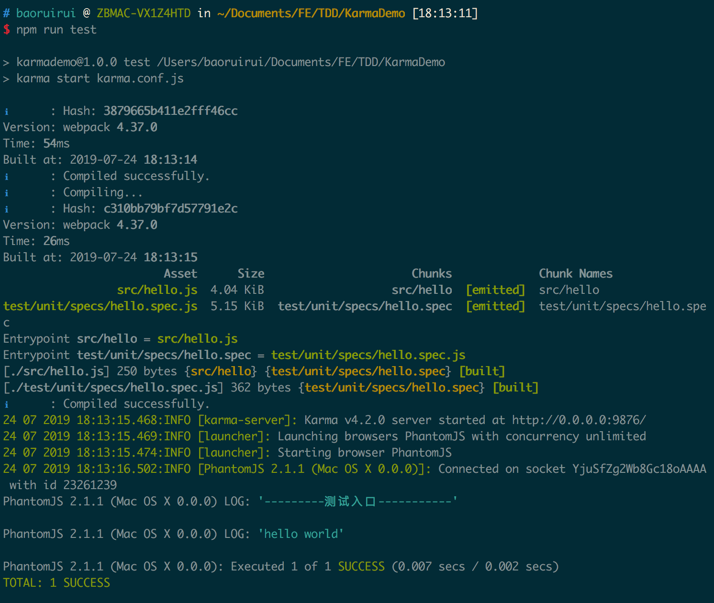

1. 新建一个KarmaDemo的项目，文件结构如下：

   

2. 按以下步骤操作：

   ```bash
   karma init #生成karma.conf.js
   npm init #生成package.json文件
   npm install karma karma-mocha karma-chai --save-dev #安装插件
   npm install mocha chai --save-dev #安装插件
   npm install phantomjs-prebuilt karma-phantomjs-launcher --save-dev #安装插件
   #修改package.json文件
   "scripts": {
       "test": "karma start karma.conf.js"
    }
   #修改karma.conf.js文件
   files: [
     './src/*.js',
     './test/unit/specs/*.spec.js'
   ],
   exclude: [
     './node_modules/'
   ],
   ```

3. 执行 npm run test，会报错：

   

   报错原因：浏览器不支持ES6 Modules。默认情况下，Karma是不支持ES6语法的。

   解决办法：让Karma支持ES6。需要使用webpack和babel

4. 安装webpack、babel相关套件

   ```bash
   #修改package.json文件的devDependencies字段如下：
   "devDependencies": {
       "@babel/core": "^7.5.5",
       "@babel/preset-env": "^7.5.5",
       "babel-loader": "^8.0.6",
       "chai": "^4.2.0",
       "karma": "^4.2.0",
       "karma-chai": "^0.1.0",
       "karma-mocha": "^1.3.0",
       "karma-phantomjs-launcher": "^1.0.4",
       "karma-webpack": "^4.0.2",
       "mocha": "^6.2.0",
       "phantomjs-prebuilt": "^2.1.16",
       "webpack": "^4.37.0"
   }
   
   #执行以下命令安装
   npm install
   ```

5. 修改karma.conf.js文件

   ```bash
   #修改karma.conf.js文件
   frameworks: ['mocha', 'chai'],
   preprocessors: { 
     './src/*.js':['webpack'], // 把es6语法转换成浏览器支持的语法再去调用浏览器
     './test/unit/specs/*.spec.js':['webpack']
   },
   
   webpack:{
       mode: 'development',
       module: {
           rules: [
               {
               test: /\.js$/,
               use: {
                   loader: 'babel-loader',
                   options: {
                       presets: ['@babel/preset-env'],
                   }
               },
               exclude: /node_modules/
           }]
       }
   },
   
   ```

6. 执行npm run test，得到结果(如图)，测试成功

   


##### 最后，附上karma.config.js配置

```javascript
// Karma configuration
// Generated on Wed Jul 24 2019 17:21:05 GMT+0800 (CST)

module.exports = function(config) {
  config.set({
    // base path that will be used to resolve all patterns (eg. files, exclude)
    basePath: '',
    
    // frameworks to use
    // available frameworks: https://npmjs.org/browse/keyword/karma-adapter
    frameworks: ['mocha', 'chai'],

    // list of files / patterns to load in the browser
    files: [
      './src/*.js',
      './test/unit/specs/*.spec.js'
    ],

    // list of files / patterns to exclude
    exclude: [
    ],

    // preprocess matching files before serving them to the browser
    // available preprocessors: https://npmjs.org/browse/keyword/karma-preprocessor
    // 预处理器，增加对webpack引用。需要使用 webpack 将这个文件作为入口进行打包处理，webpack 会查找这个文件依赖的内容，将所有的内容打包，最后输出一个打包文件，这个文件才是需要测试环境处理的文件
    preprocessors: { 
      './src/*.js':['webpack'], // 把es6语法转换成浏览器支持的语法再去调用浏览器
      './test/unit/specs/*.spec.js':['webpack']
    },
    
    webpack:{
        mode: 'development',
        module: {
            rules: [
                {
                test: /\.js$/,
                use: {
                    loader: 'babel-loader',
                    options: {
                        presets: ['@babel/preset-env'],
                    }
                },
                exclude: /node_modules/
            }]
        }
    },

    // test results reporter to use
    // possible values: 'dots', 'progress'
    // available reporters: https://npmjs.org/browse/keyword/karma-reporter
    reporters: ['progress'],

    // web server port
    port: 9876,

    // enable / disable colors in the output (reporters and logs)
    colors: true,

    // level of logging
    // possible values: config.LOG_DISABLE || config.LOG_ERROR || config.LOG_WARN || config.LOG_INFO || config.LOG_DEBUG
    logLevel: config.LOG_INFO,

    // enable / disable watching file and executing tests whenever any file changes
    autoWatch: true,

    // start these browsers
    // available browser launchers: https://npmjs.org/browse/keyword/karma-launcher
    browsers: ['PhantomJS'],

    // Continuous Integration mode
    // if true, Karma captures browsers, runs the tests and exits
    singleRun: true,

    // Concurrency level
    // how many browser should be started simultaneous
    concurrency: Infinity
  })
}

```

