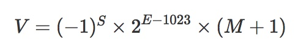
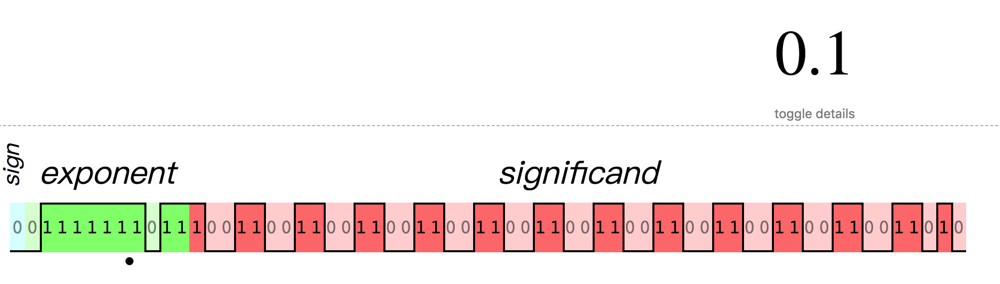
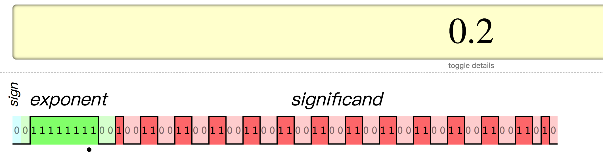

###JavaScript浮点数

>不知道大家在平时的搬砖中有没有遇到过关于JavaScript浮点数相关的坑，比如经典的双精度问题：0.1+0.2=0.30000000000000004。

#### 一、抛出问题

1. 为什么0.1 + 0.2 != 0.3 ?
2. 为什么 1.005.toFixed(2) = 1.00 而不是 1.01 ?

#### 二、IEEE 754双精度浮点数规范

1. 通过二进制的科学计数法存储

   和十进制的科学法类似，二进制的科学计数法为1.xxx * 2 ^ N。注意：二进制科学计数法的整数部分都为1，所以在存储时省略整数部分1。

   > 知识点：十进制转二进制（numberObject.toString(2)）
   >
   > 在线转换工具：[参考这里](https://www.rapidtables.com/convert/number/decimal-to-binary.html)
   >
   > 二进制转十进制：[参考这里](https://www.jianshu.com/p/e301de533bc3)

2. 64位存储格式：1个符号位 + 11个指数位 + 52个尾数位

   - 符号位S：第1位是正负数符号位（sign），0代表正数，1代表负数

   - 指数为E：中间的11位存储指数（exponent），用来表示次方数。科学计数法中指数E是可以为负数的，在表示负的指数时IEEE754标准引入了一个偏移量1023，在存储指数时加上该偏移量把负数E转成正数。这就导致11位的指数能够表示指数的范围是[-1023, 1024]。

   - 尾数位M：最后的 52 位是尾数（mantissa），超出的部分自动进一舍零，没有填满的部分自动补0
     如10进制数400.12，用10进制科学计数法表示为：4.0012 * 10 ^ 2,。其中"0012"就是尾数部分

     最终表示为：

     

     其中，S, E, M都是实际存储科学计数法的值。

     举个例子：

     > 十进制4.5转成二进制为：
     >
     > ```javascript
     > // 1. 转为二进制
     > 100.1
     > // 2. 转为二进制科学计数法
     > 1.001 * 2 ^ 2
     > 
     > S => 0
     > E => 2 + 1023 = 1025
     > M => 001 // 尾数部分，整数1被省略了
     > ```
     >
     > 查看具体的存储情况: [可参考这里](http://www.binaryconvert.com/result_double.html)
     >
     > 或 [这里](http://bartaz.github.io/ieee754-visualization/)

#### 三、解答问题

1. 第一个问题：为什么0.1 + 0.2 != 0.3 ?

   在浏览器控制台测试一下，可以看到结果如下：

   ```javascript
   0.1 + 0.2 // 0.30000000000000004
   ```

   问题解析：

   ```javascript
   0.1 转 二进制 => 0.0001100110011001100...（1100循环）
   转科学计数法 => 1.100110011001100...(1100循环) * 2 ^ -4
   数据是无限循环的，但是可供使用的尾数却是有限的，只有52位可以使用，所以在第53位会被舍去并且进位
   ```

   最终在计算机中存储如下图：

   

   类似的0.2在计算机中的存储如下图：

   

   所以最终计算是：

   ```javascript
     0.00011001100110011001100110011001100110011001100110011010
   + 0.0011001100110011001100110011001100110011001100110011010
   = 0.0100110011001100110011001100110011001100110011001100111
   ```

   计算结果转换为十进制：0.30000000000000004。

   所以就是因为：0.1和0.2在计算机中的二进制存储会让它们本身损失掉一定的精度，而它们在计算机中的二进制存储转换成十进制时已经不是真正的0.1和0.2了，相加的结果也就自然不是0.3了。

2. 第二个问题：为什么 1.005.toFixed(2) = 1.00 而不是 1.01 ?

   1. 首先，我们解答下面的问题：

      **既然0.1在计算机中的存储已经有了舍入误差，那为什么num = 0.1能得到0.1呢？**

      可以再控制台使用toPrecision()看一下0.1在不同精度下的返回:

      ```javascript
      0.1.toPrecision(16) // 0.1000000000000000
      0.1.toPrecision(20) // 0.10000000000000000555
      0.1.toPrecision(52) // 0.1000000000000000055511151231257827021181583404541016
      0.1.toPrecision(64) // 0.1000000000000000055511151231257827021181583404541015625000000000
      ```

      实际上，0.1是截断了一部分精度后得到的结果。那么，双精度浮点数是按什么规则来进行截断的呢？

      > 如果一个双精度的浮点数转为十进制的数字时，只要它转回来的双精度浮点数不变，精度取最短的那个就行。([参考英文wiki](https://link.juejin.im/?target=https%3A%2F%2Fen.wikipedia.org%2Fwiki%2FDouble-precision_floating-point_format))

      拿0.1举例：

      ​	0.1和0.10000000000000001转成双精度浮点数的存储是一样的，所以取最短的0.1就行了。

   2. 现在解答一下：为什么 1.005.toFixed(2) = 1.00 ？
      之前已经说过，一个十进制数转为双精度浮点数，然后再取出来时，跟原十进制数可能会有误差。

      试一下1.005取20个精度：

      ```javascript
      1.005.toPrecision(20) // 1.0049999999999998934
      ```

      很明显，1.005是被截断后的数字，它的双精度浮点数代表的20位精度的数字是1.0049999999999998934，所以进行保留2位的四舍五入时，2位后的数字会被全部舍去，最终得到1.00。

#### 四、如何优雅的取数值的整数和小数部分

- 取整数

  在一些项目中经常能看到，parseInt() 常用来取整数部分，一般情况下，结果是没有问题的。但严格来说，其实parseInt不是用来取整数的。

  > 知识点：parseInt(string, radix) 是将一个字符串转换为整数的方法。第一个参数string：要转换的字符串，如果参数不是一个字符串，则先将其转换为字符串。第二个参数radix：进制，默认为10。

  ```javascript
  let num = 2.55
  console.log(parseInt(num)) // 2，先将2.55转为字符串"2.55",然后再parseInt成为2
  num = -2.55
  console.log(parseInt(num)) // -2
  let str = '3.12'
  console.log(parseInt(str)) // 3
  ```

  所以，用parseInt()取整有2个不好的地方：

  1. 该函数用于将字符串转整数

  2. 转字符串有点多此一举，而且会带来性能开销

  3. 严重bug

     ```javascript
     console.log(parseInt(0.00000001))	// 1
     
     // 分步骤如下：
     // 1. 转字符串
     0.00000001.toString() // 1e-8
     // 2. 转为整数
     parseInt('1e-8') // 1
     ```

  用Math方法取整，相关有3个方法：Math.ceil()-向上取整、Math.round()-四舍五入、Math.floor()-向下取整。达到parseInt()的结果，需要判断数值的符号，如果是负数，则向上取整；如果是正数，则向下取整。

  ```javascript
  // 取整数
  function trunc(num) {
  	if (num >= 0) {
  		return Math.floor(num) // 向下取整
  	} 
  	return Math.ceil(num) // 向上取整
  }
  
  trunc(1.1) // 1
  trunc(1.9) // 1
  trunc(-1.1) // -1
  trunc(-1.9) // -1
  ```

  实际上，在ES2015之后，还提供了Math.trunc()，可以直接使用。

- 取小数

  取了整数部分，取小数部分就很简单了：

  ```javascript
  // 思路：先用Math.trunc(num)取整，再与原数相减，就得到小数部分
  function fract(num) {
    return num - Math.trunc(num)
  }
  console.log(fract(3.75)) // 0.75
  console.log(fract(-3.75)) // -0.75
  ```

  但是，还有更简单的方式：

  > js的取模运算%并不限于整数运算，对浮点数也同样适用

  ```javascript
  console.log(3.75 % 1); // 0.75
  console.log(-3.75 % 1); // -0.75
  ```

  反过来，可以倒推出另一种实现trunc取整的方式：

  ```javascript
  function trunc(num) {
  	return num - num % 1; 
  }
  console.log(trunc(2.55)) // 2.55 - 0.55 = 2
  console.log(trunc(-2.55)) // -2.55 - (-0.55) = -2
  ```


##### 文章参考链接：

[[JS-Number—了解IEEE双精度浮点数](https://segmentfault.com/a/1190000013177214)](https://segmentfault.com/a/1190000013177214)

[前端应该知道的JavaScript浮点数和大数的原理](https://juejin.im/post/5cf667b6f265da1bc23f6536?utm_medium=hao.caibaojian.com&utm_source=hao.caibaojian.com#heading-8)